# Two-edged Sword

A Bible study app for macOS, for reading Bibles, commentaries, dictionaries and books beside your own
notes. It comes with the KJV, Strong's dictionaries, the Treasury of Scripture Knowledge, Matthew Henry's
commentary and Easton's Bible Dictionary, and reads
more modules in e-Sword X's formats: your own, and e-Sword X's library if you have it.
It only reads them, and keeps your journal, highlights and plans separately.

## Download

For a Mac with Apple silicon (M1 or later) and macOS 13 or later.

1. Download [Two-edged-Sword.dmg](https://github.com/waynetd777/two-edged-sword/releases/latest/download/Two-edged-Sword.dmg) from the [latest release](https://github.com/waynetd777/two-edged-sword/releases/latest).
2. Open it and drag **Two-edged Sword** onto **Applications**.
3. Open Two-edged Sword from Applications. macOS says it can't check the app for malicious software, because it isn't notarised by Apple. Click **Done**.
4. Open System Settings › Privacy & Security, scroll down and click **Open Anyway** beside Two-edged Sword, then **Open Anyway** again and enter your password.

It opens normally after that. The first time you use some features, macOS asks for permission: see [First run](docs/features.md#first-run).

<a href="docs/images/index.md#the-readme"><picture><source media="(prefers-color-scheme: dark)" srcset="docs/images/read-dark.png">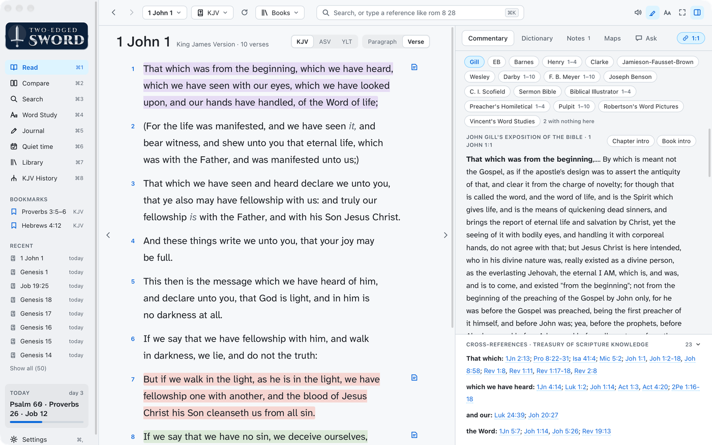</picture></a>

## What it does

- **Read** a chapter beside every commentary on the verse, cross-references, dictionaries and
  your notes. Click any word for its Greek or Hebrew.
- **Highlight** in eight colours, each standing for a theme you name.
- **Books and devotionals** from your library, with the same tools as Scripture.
- **Listen** to anything read aloud, each word highlighted as it's spoken.
- **Differences from the KJV**: a mark wherever a translation differs in meaning, and why.
- **Greek and Hebrew** word by word, each word over its English and Strong's number.
- **Ask** questions about what you're reading, answered from your own library.
- **Compare** translations side by side, **Search** the whole library, and **Word Study** a Greek
  or Hebrew word.
- **Journal** entries linked to their verses, kept in step with Obsidian.
- **Quiet time** plans, with worship songs chosen for the day and a daily reminder.
- **Build more modules** from free sources, such as the Targums, the Talmud and the Vulgate.
- **KJV History**: the manuscripts and editions behind the KJV, and which you have.

<table>
  <tr>
    <td align="center"><a href="docs/reading.md#books-and-devotionals"><picture><source media="(prefers-color-scheme: dark)" srcset="docs/images/books-dark.png">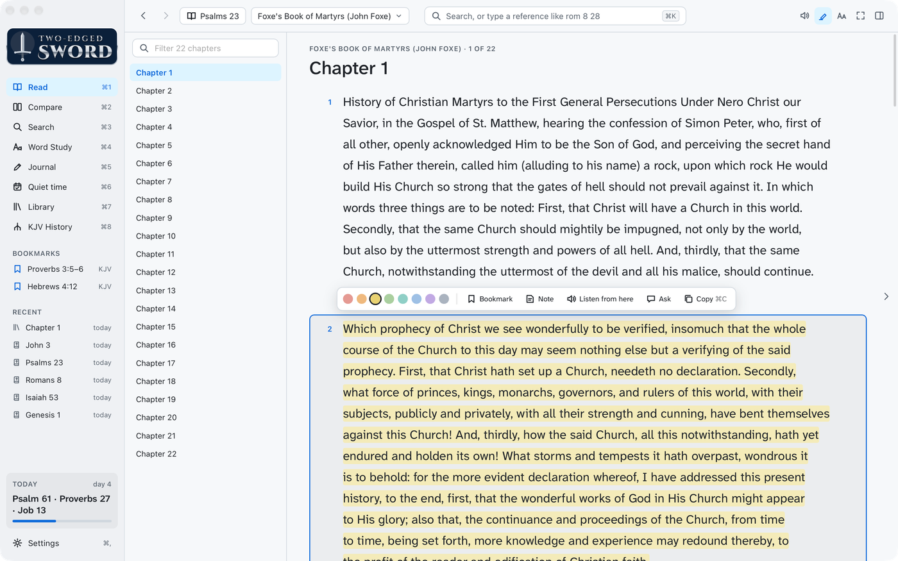</picture></a><br><sub><a href="docs/reading.md#books-and-devotionals">Books and devotionals</a></sub></td>
    <td align="center"><a href="docs/reading.md#listen"><picture><source media="(prefers-color-scheme: dark)" srcset="docs/images/listen-dark.png">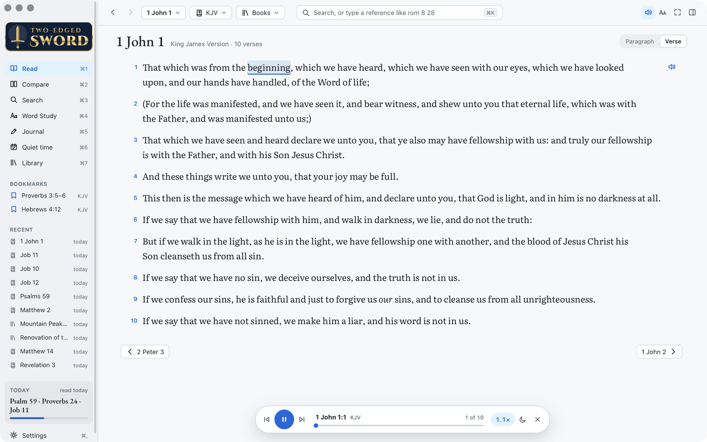</picture></a><br><sub><a href="docs/reading.md#listen">Listen, word by word</a></sub></td>
  </tr>
  <tr>
    <td align="center"><a href="docs/manuscripts.md#differences-from-the-kjv"><picture><source media="(prefers-color-scheme: dark)" srcset="docs/images/differences-dark.png">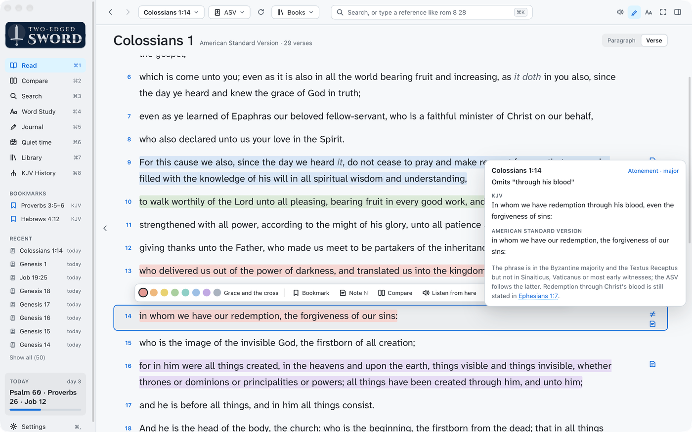</picture></a><br><sub><a href="docs/manuscripts.md#differences-from-the-kjv">Differences from the KJV</a></sub></td>
    <td align="center"><a href="docs/manuscripts.md#greek-and-hebrew"><picture><source media="(prefers-color-scheme: dark)" srcset="docs/images/interlinear-dark.png">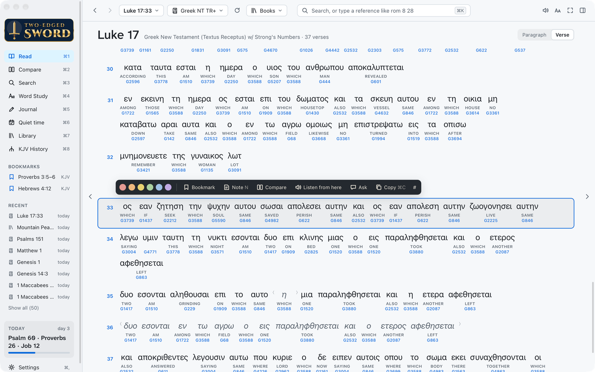</picture></a><br><sub><a href="docs/manuscripts.md#greek-and-hebrew">Greek word by word</a></sub></td>
  </tr>
  <tr>
    <td align="center"><a href="docs/ask.md"><picture><source media="(prefers-color-scheme: dark)" srcset="docs/images/ask-dark.png">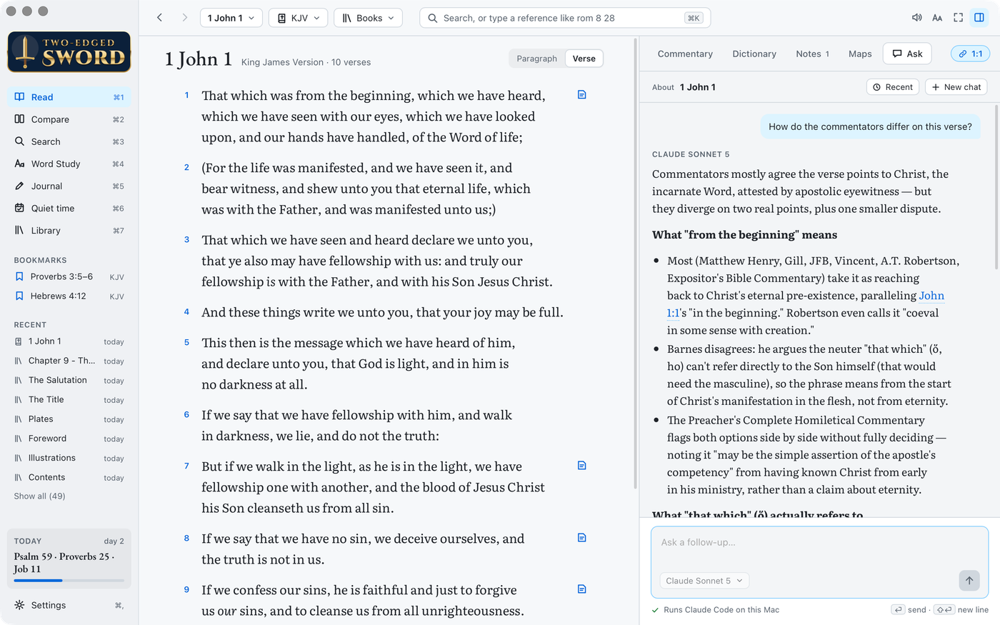</picture></a><br><sub><a href="docs/ask.md">Ask compares the commentators</a></sub></td>
    <td align="center"><a href="docs/study.md#compare"><picture><source media="(prefers-color-scheme: dark)" srcset="docs/images/compare-dark.png">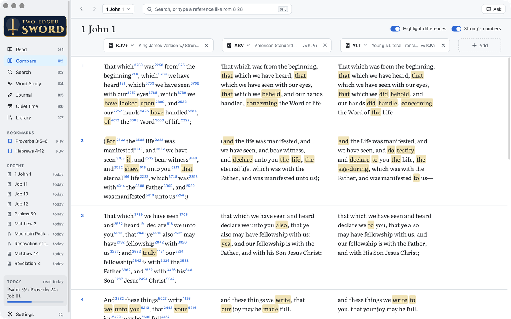</picture></a><br><sub><a href="docs/study.md#compare">Compare translations</a></sub></td>
  </tr>
  <tr>
    <td align="center"><a href="docs/study.md#search"><picture><source media="(prefers-color-scheme: dark)" srcset="docs/images/search-dark.png">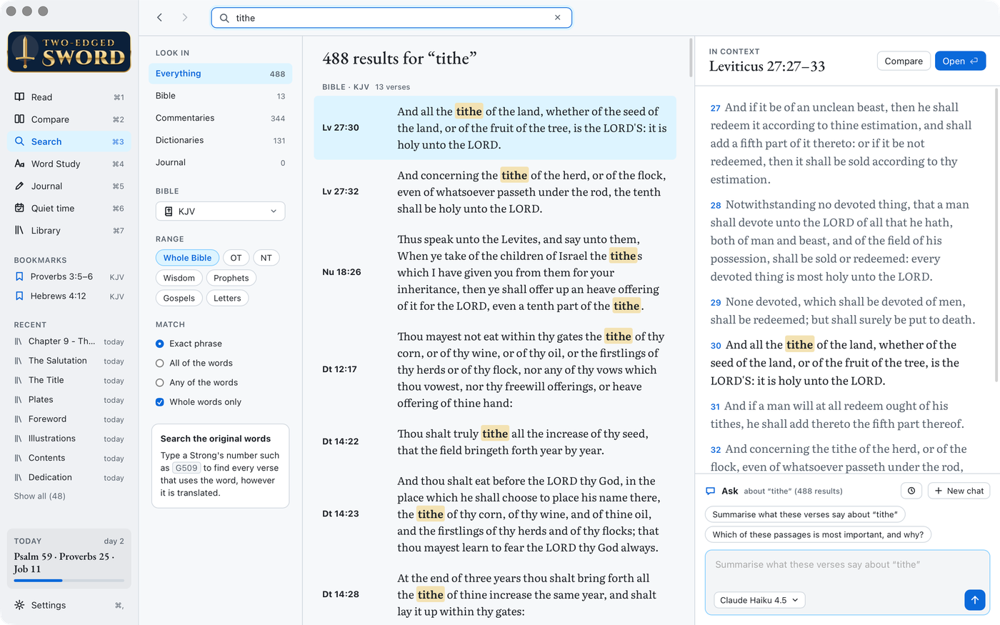</picture></a><br><sub><a href="docs/study.md#search">Search the whole library</a></sub></td>
    <td align="center"><a href="docs/study.md#word-study"><picture><source media="(prefers-color-scheme: dark)" srcset="docs/images/word-study-dark.png">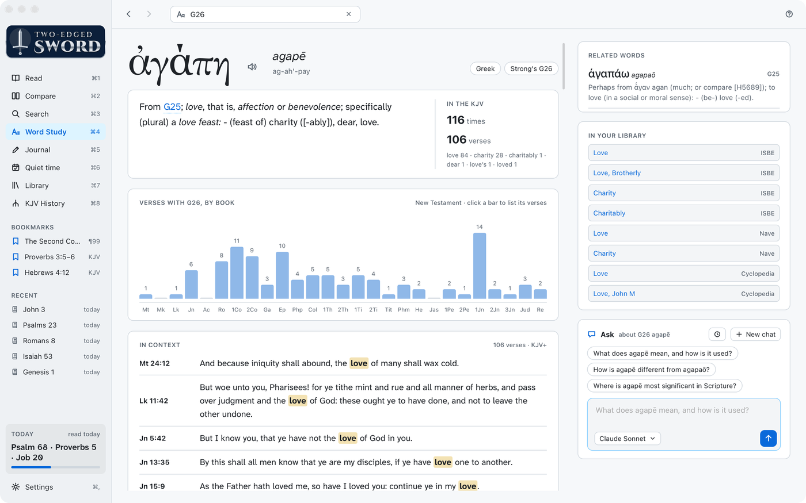</picture></a><br><sub><a href="docs/study.md#word-study">Word Study</a></sub></td>
  </tr>
  <tr>
    <td align="center"><a href="docs/journal.md"><picture><source media="(prefers-color-scheme: dark)" srcset="docs/images/journal-dark.png">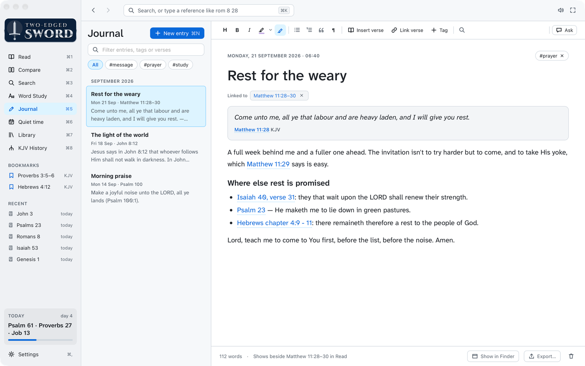</picture></a><br><sub><a href="docs/journal.md">Journal, linked to verses</a></sub></td>
    <td align="center"><a href="docs/quiet-time.md#plans"><picture><source media="(prefers-color-scheme: dark)" srcset="docs/images/quiet-time-dark.png">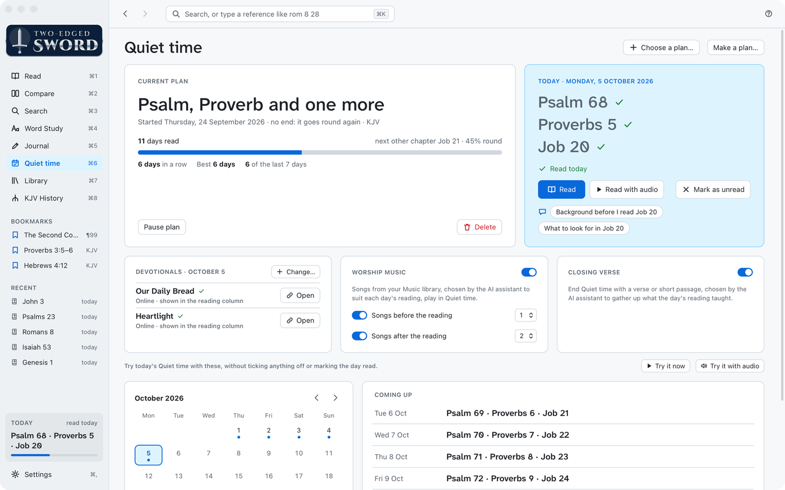</picture></a><br><sub><a href="docs/quiet-time.md#plans">Quiet time plans</a></sub></td>
  </tr>
  <tr>
    <td align="center"><a href="docs/quiet-time.md#worship-music"><picture><source media="(prefers-color-scheme: dark)" srcset="docs/images/worship-dark.png">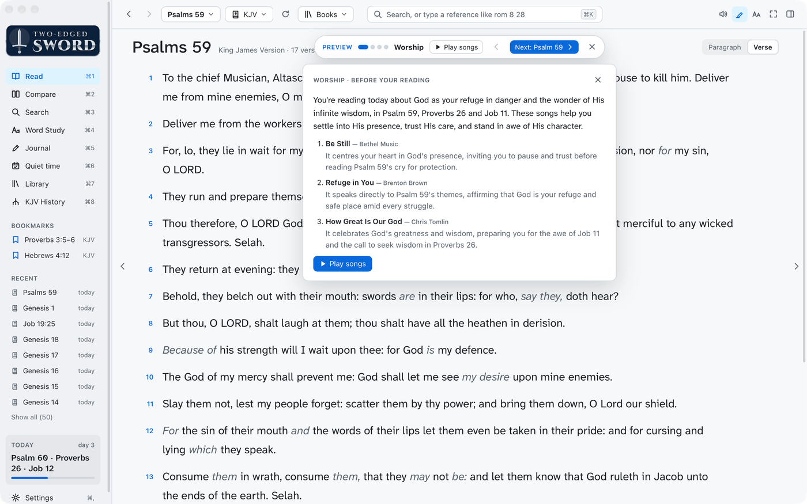</picture></a><br><sub><a href="docs/quiet-time.md#worship-music">Worship songs for the day</a></sub></td>
    <td align="center"><a href="docs/manuscripts.md#kjv-history"><picture><source media="(prefers-color-scheme: dark)" srcset="docs/images/kjv-history-dark.png">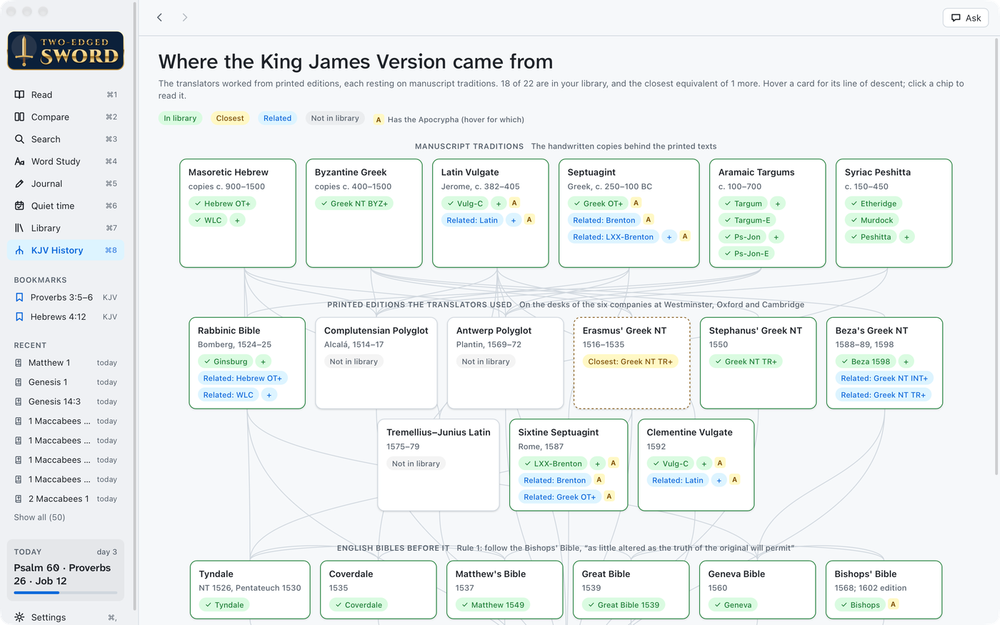</picture></a><br><sub><a href="docs/manuscripts.md#kjv-history">KJV History</a></sub></td>
  </tr>
</table>

## Quick start

Needs macOS 13 or later, the Xcode Command Line Tools, Rust, Node and pandoc. The built-in modules
are downloaded and built on the first `make dev` or `make app` (`make core`). Ask also needs Claude Code, Codex, Antigravity or GitHub Copilot.

```sh
npm install
make dev                                  # the app with hot reload
cp signing.local.example signing.local    # then name your signing certificate in it
make install-app                          # build it and put it in /Applications
```

Without a signing certificate, macOS asks for access to e-Sword's data after every build, if you have e-Sword X
([Signing and Full Disk Access](docs/development.md#signing-and-full-disk-access)).

Licensed Bibles are read where e-Sword keeps them and never copied into this repo.

## Thanks

To Rick Meyers, whose free e-Sword has put God's word into the hands of millions since 2000. This
app reads e-Sword X's formats and library, and owes that to his work
([e-sword.net](https://www.e-sword.net)).

## Licence

Two-edged Sword is free software under the [GNU General Public License](LICENSE), version 3 or
later: you may use, share and change it, and anything you pass on must stay free under the same
licence. The Bible texts and books it reads keep their own terms: the built-in modules are public
domain ([Library](docs/library.md#built-in-modules)), and so on for the rest
([Licence and credits](docs/features.md#licence-and-credits)).

## Documentation

The same guides are in the app, under Help (⌘?).

- [Features](docs/features.md): getting around and Settings, then [Reading](docs/reading.md),
  [Study](docs/study.md), [Translations and manuscripts](docs/manuscripts.md),
  [Journal](docs/journal.md) and [Quiet time](docs/quiet-time.md)
- [Ask](docs/ask.md): the AI assistant and what it sends
- [Library](docs/library.md): your modules, adding and building more, and free ones worth having
- [Development](docs/development.md): building, signing, where data lives, and the code
