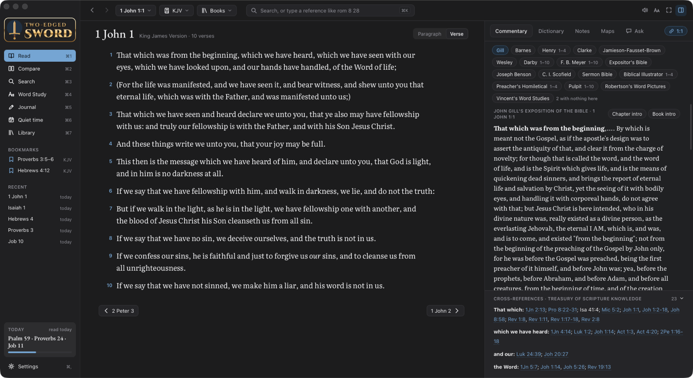
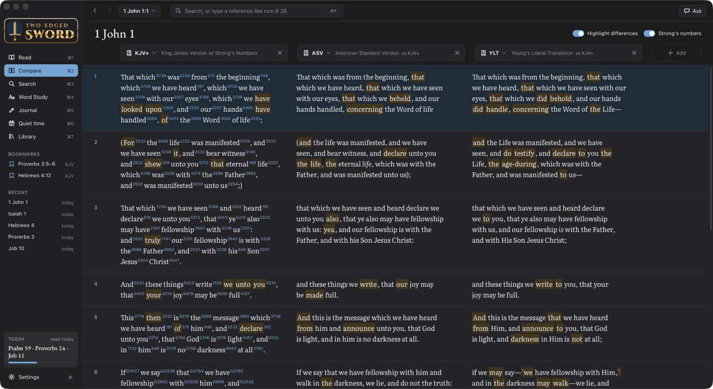
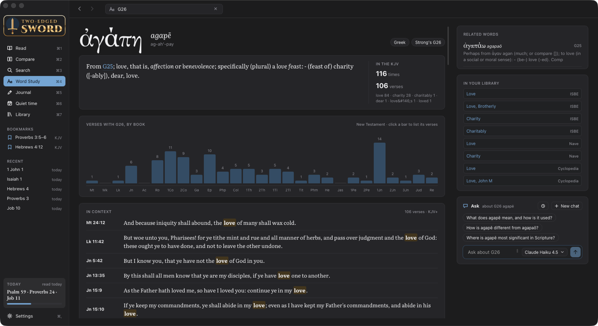
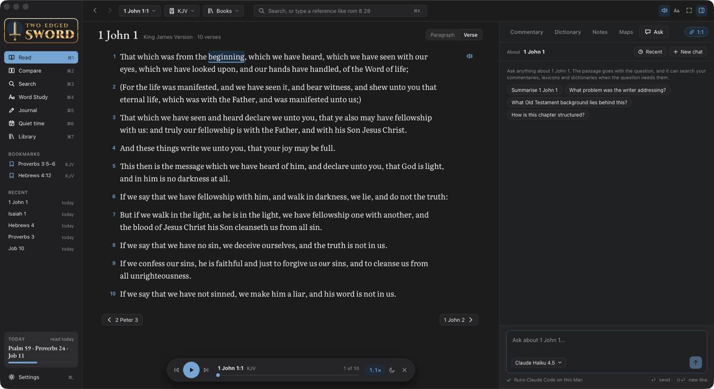
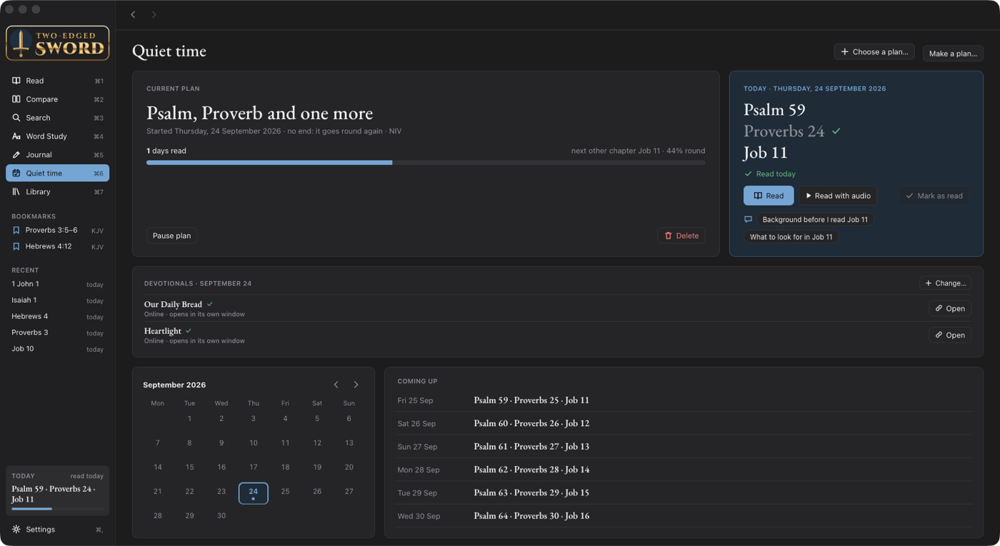
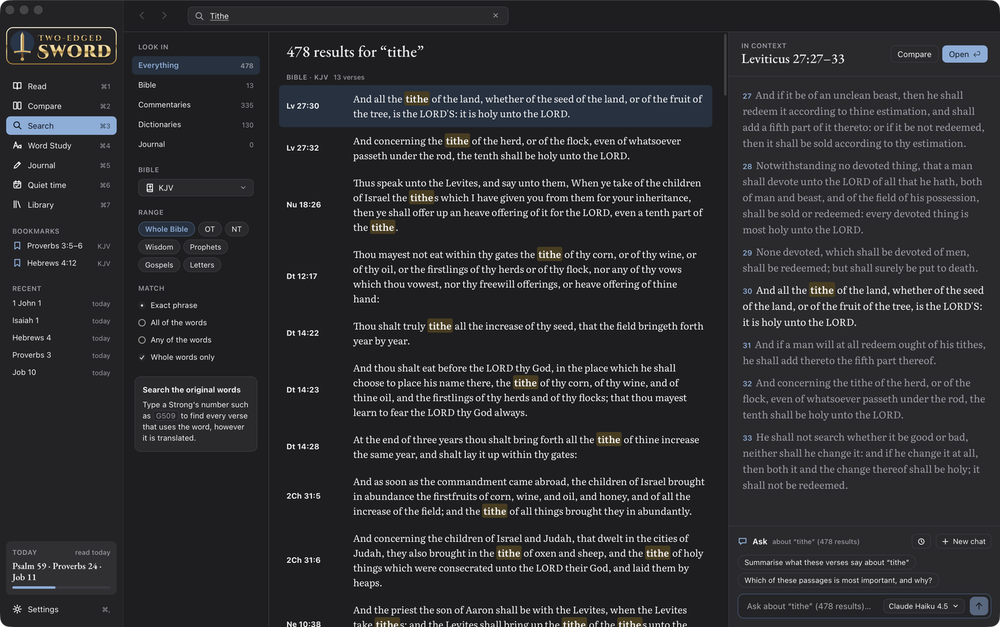

# Two-edged Sword

A personal Bible study app for macOS, built on the Bibles, commentaries, dictionaries, lexicons,
reference books, devotionals and maps you already have in e-Sword X. It opens every module
read-only and keeps what you make (journal, bookmarks, highlights, plans, chats) separately.



## What it does

- **Read** a chapter beside a study pane with every commentary on the verse, cross-references,
  dictionaries, your notes and maps. Click any word for its Greek or Hebrew.
- **Ask** questions about what you're reading. The assistant searches your own commentaries,
  lexicons and dictionaries and names its sources. It runs on Claude Code or Codex, if either
  is installed.
- **Compare** any number of translations verse by verse, with the differences highlighted.
- **Word Study** a Strong's number: where it is used, every verse in context, and the articles
  about it in your library.
- **Listen** to a chapter read aloud in any macOS voice, including the Premium ones, with each
  word highlighted as it is spoken.
- **Quiet time** plans with daily readings and devotionals, a **Journal** linked to the verses
  it's about, and **Search** across the whole library.

| | |
|---|---|
|  |  |
|  |  |
|  |  |

## Documentation

- [Features](docs/features.md): each screen, and keyboard shortcuts
- [Ask](docs/ask.md): the AI assistant, which models it offers, and what it sends
- [Library](docs/library.md): e-Sword modules, adding more, and free ones worth having
- [Development](docs/development.md): building, signing, where data lives, and the code

## Quick start

Needs macOS, e-Sword X with some modules, Rust and Node.

```sh
npm install
make dev            # the app with hot reload
make install-app    # build it and put it in /Applications
```

The first time it reads e-Sword's modules, macOS asks for access to another app's data. See
[Signing and Full Disk Access](docs/development.md#signing-and-full-disk-access) to stop it
asking after every build.

Licensed Bibles (NIV, ESV and others) are for personal use: they are never copied into this repo,
and the app only reads them where e-Sword keeps them.
