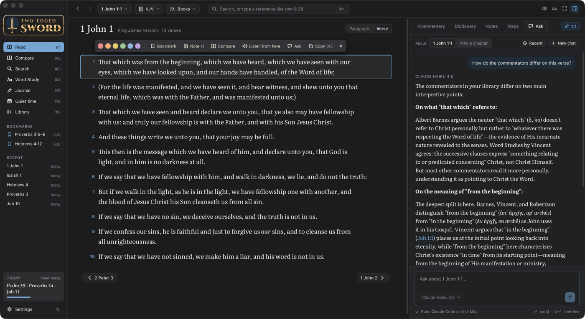

# Ask

Ask answers questions about what you are reading: a verse or chapter in Read or Compare, a
word in Word Study, search results, a journal entry, or a chapter or paragraph of a reference
book or devotional. Chats are kept on this Mac, can be found again from **Recent** on any Ask
panel, and an answer can be added to your journal.

## Claude Code or Codex

Ask doesn't talk to an AI service itself. It runs an AI command-line tool already installed and
signed in on this Mac, so it uses your existing account:

- **Claude Code** (`claude -p`), offering Claude Opus, Sonnet and Haiku.
- **Codex** (`codex exec`), offering whichever models Codex's own model picker shows for your
  account, so the list stays current without an app update.

The model menu on each Ask panel lists the models from whichever tools are installed, and
Settings › AI assistant shows what was found and sets the default. A chat keeps the model it
started with.

**If neither is installed, Ask is hidden** everywhere: panels, buttons, the study pane's Ask
tab, the command palette entry. Install one, sign in, and open Settings; Ask appears without a
restart.

Claude streams its answer as it writes. Codex's answer appears all at once when it is done. While
either is searching your library, the panel shows what it is doing ("Reading Matthew Henry's
Commentary…").

## Answers from your library

In a chat about a Bible passage, the app writes out your library's material on it as plain text
files, and the assistant searches them instead of answering from memory:

- `digest.txt`: every commentary's notes on the passage, the first ~400 words of each, in one
  file. Most questions are answered from this alone, which keeps answers quick.
- `commentaries/`: each commentary's full notes on the passage, with its chapter and book
  introductions.
- `passage/`: the passage in each of your Bibles.
- `lexicons/`: every lexicon's entry for each Strong's number in the passage.
- Your dictionaries, each written out whole once (a few seconds, in the background, the first
  time the app starts after they change).

The assistant decides whether a question needs them. "How do the commentators differ on this
verse?" makes it read the digest and compare named commentators; a quick factual question, or a
follow-up on its own answer, is answered straight away. It is told to name the source for each
point and to say when your library has nothing on something.

Settings › AI assistant › **Search my library** turns this off, and the assistant then has the
passage text only.

A chat about a reference book or devotional works the same way with that book: the chapter goes
with the question (or about 6,000 words around the paragraph asked about), and the whole book is
written out once, one file per chapter with its charts, for the assistant to search.

## What is sent

Each question goes to the AI tool with the passage text. Whatever the assistant reads from the
library folder is sent too, as it reads it: only the parts it opens, not the whole folder.

**Licensed Bibles.** With Settings › Licensed translations off, questions about the NIV, ESV
and other licensed Bibles send public-domain text instead, and licensed Bibles are left out of
the library folder.

**What the assistant can reach.** Claude Code can only read the chat's folder and the exported
dictionaries (read and search tools, confined there). Codex runs in its read-only sandbox,
ignores your own Codex configuration (MCP servers, hooks, rules), and is told to stay in those
folders; its sandbox does not enforce that, so it could technically read other files on the Mac.
Neither can change anything.

## Where it keeps things

Under `~/Library/Application Support/Two-edged Sword/`:

| What | Where |
|---|---|
| Chats | `chats.json` |
| A passage chat's library folder | `ask/studies/<chat>/` (removed after 60 days unused) |
| Dictionaries, written out whole | `ask/dictionaries/` |
| Reference books and devotionals, written out | `books/` |
| Working folders for chats without one | `claude/`, `codex/` |
