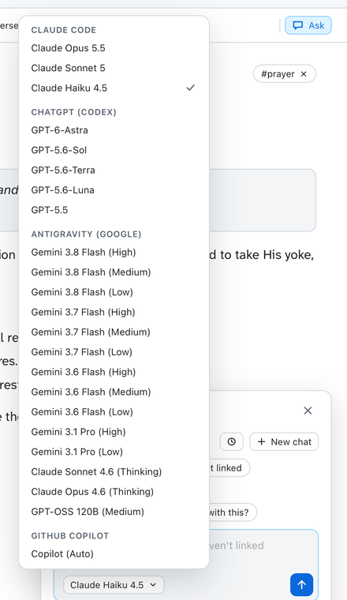

# Ask

<a href="images/index.md#ask"><picture><source media="(prefers-color-scheme: dark)" srcset="images/ask-dark.png"></picture></a>

Ask answers questions about whatever you're looking at: a passage, a word, search results, a
journal entry or a book. It answers from your own commentaries, lexicons and dictionaries, and
names its sources.

- Chats stay on this Mac. Find them under **Recent** on any Ask panel.
- Opening an old chat takes you back to where it started.
- An answer can be added to your journal in one click.
- Ask also knows this guide, so you can ask how to do something in the app ("how do I hide my
  highlights?").

## Claude Code, Codex, Antigravity or Copilot

Ask runs an AI tool you already have installed and signed in on this Mac, so it uses your own
account:

- **Claude Code**: Claude Opus, Sonnet and Haiku.
- **Codex**: the models your Codex account offers.
- **Antigravity**: the models your Google account offers, such as Gemini.
- **GitHub Copilot**: whichever model your plan allows.

<a href="images/index.md#ask"><picture><source media="(prefers-color-scheme: dark)" srcset="images/ask-models-dark.png"></picture></a>

Choose a model from the menu on any Ask panel; it becomes the default. Settings › AI assistant
shows which tools were found.

**If no tool is installed, Ask is hidden.** Install one and sign in (run Codex or Antigravity
once in Terminal), then open Settings, and Ask appears.

## Answers from your library

For a question about a passage, the app gives the assistant your library's material on it:
commentaries, the passage in each Bible, lexicon entries, dictionaries, differences from the KJV,
and reference books that cite the verses.

- The assistant decides what it needs. A quick question is answered at once; "how do the
  commentators differ?" makes it read and compare them.
- It's told to name the source for each point, and to say when your library has nothing.
- **Include my journal** (Settings › AI assistant, off at first) adds your entries on the passage.
- **Search my library** off gives it only the passage text.

Books and devotionals work the same way: the assistant can search the whole book.

## What is sent

The first question goes with what you're looking at, such as the passage or the open journal
entry. After that, only what the assistant chooses to read is sent.

**Licensed text.** Turn off Settings › AI assistant › **Licensed text** and no copyrighted
module's text is sent. A licensed Bible is swapped for a public-domain one, and licensed
commentaries, dictionaries and books are left out.

**What the assistant can do.** Each tool is given only its read and search tools, and none of
them can change files.

- Claude Code, Antigravity and Copilot are kept to the chat's own folder. Your Claude Code
  settings still load, and an allow rule there could widen that.
- Codex runs in its read-only sandbox. It's told to stay in the chat's folder, but nothing
  enforces that.

Each tool keeps its usual history of your questions, in `~/.claude/`, `~/.codex/`,
`~/.gemini/antigravity-cli/` or `~/.copilot/`.

## Where it keeps things

Under `~/Library/Application Support/Two-edged Sword/`:

| What | Where |
|---|---|
| Chats | `chats.json` |
| A passage chat's files | `ask/studies/<chat>/` (removed after 60 days unused) |
| A journal chat's files | `ask/journal/<chat>/` (removed after 60 days unused) |
| Dictionaries and books, written out | `ask/dictionaries/`, `books/` |
