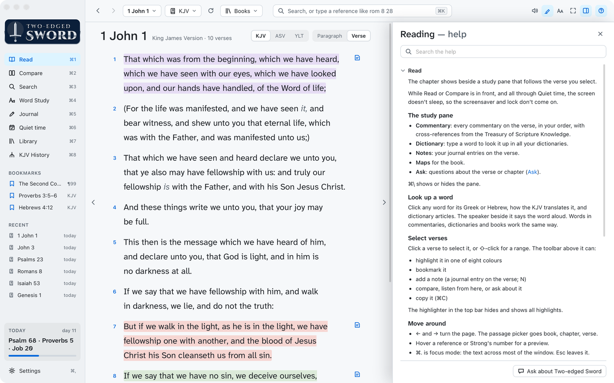

# Features

A Bible study app for macOS, for reading Bibles, commentaries, dictionaries and books beside your own
notes. It comes with the KJV, Strong's dictionaries, the Treasury of Scripture Knowledge, Matthew Henry's
commentary and Easton's Bible Dictionary, and reads
more modules in e-Sword X's formats: your own, and e-Sword X's library if you have it.
It only reads them, and keeps your journal, highlights and plans separately.

| Page | What's in it |
|---|---|
| [Reading](reading.md) | Read with the study pane, books and devotionals, Listen, songs for the chapter |
| [Study](study.md) | Compare translations, Search, Word Study |
| [Translations and manuscripts](manuscripts.md) | Differences from the KJV, Greek and Hebrew, KJV History, the Targums and Talmud |
| [Journal](journal.md) | Entries linked to verses, kept in step with Obsidian |
| [Quiet time](quiet-time.md) | Reading plans, worship music, the reminder, the menu bar |
| [Ask](ask.md) | The AI assistant and what it sends |
| [Library](library.md) | Your modules, adding and building more |

## First run

The app isn't notarised by Apple, so macOS blocks it the first time it's opened. To open it:

1. Open it once and close the warning.
2. Go to System Settings › Privacy & Security and click **Open Anyway** beside Two-edged Sword.

After that, macOS asks once for each thing the app uses:

| Prompt | When | For |
|---|---|---|
| Access data from other apps | First launch, if e-Sword X is installed | Reading e-Sword X's library |
| Documents folder | First journal save | The journal, in Documents › Two-edged Sword |
| Notifications | Turning on the daily reminder | The [reminder](quiet-time.md#daily-reminder) |
| Control Music | First worship song | [Worship music](quiet-time.md#worship-music) |

Something refused by mistake can be allowed in System Settings › Privacy & Security.

## Getting around

| Keys | Does |
|---|---|
| ⌘1 to ⌘8 | Switch screens |
| ⌘K | Go to a reference, word, Strong's number or command |
| ⌘[ and ⌘] | Back and forward, to where you were |
| ⌘, | Settings |
| ⌘+ and ⌘− | Bigger or smaller reading text: the Bible, books, the journal and the Study pane |
| ⌘P | Play or pause reading aloud ([Listen](reading.md#listen)) |
| ? or ⌘? | Help for the screen you're on |

- **Back and forward** (top left) remember screens, passages, words and searches.
- The **sidebar** lists your bookmarks and recent chapters. Hover one for a preview; × removes it.
- Hover any control to see what it does.
- The **Help** menu has this help (⌘?) and **Two-edged Sword Website**. **About Two-edged Sword**, in the
  app menu, shows the version, with the website under it.
- The **?** at the top right opens the help beside the screen, at the part of the guides for that
  screen. Type to search every page; **Ask about Two-edged Sword** asks the assistant instead.
  Esc closes it.

<a href="images/index.md#features"><picture><source media="(prefers-color-scheme: dark)" srcset="images/help-dark.png"></picture></a>

## Settings

- **Appearance**: theme, font and size, words of Jesus in red, verse or paragraph layout.
- **Bibles**: the default translation, up to three favourites, and the Compare columns.
- **Highlights**: a name for each of the eight colours, such as a theme.
- **Listening**: voices, speed, whether to highlight each word and read on, and the pictures
  shown while a song plays.
- **Journal**: its folder, notes beside verses, and grammar checking.
- **Quiet time**: the daily reminder, and what to do when you fall behind.
- **AI assistant**: which tools are installed, the default model, what Ask may read and send, and
  whether it suggests a next question ([Ask](ask.md)).
- At the bottom: the app's version and build number, its licence, and **Website**, which opens
  [two-edged-sword.davies.co.za](https://two-edged-sword.davies.co.za/).

## Licence and credits

Two-edged Sword is free software under the GNU General Public License, version 3 or later.

- You may use it, share it and change it.
- Anything you pass on, changed or not, must stay free under the same licence, with its source.
- It comes with no warranty.
- The licence is in `LICENSE` in the source, and at [gnu.org](https://www.gnu.org/licenses/gpl-3.0.html).

The Bibles and books keep their own terms:

| What | Terms |
|---|---|
| The built-in modules | Public domain: eBible.org and the CrossWire Bible Society (the KJV, the TSK), Open Scriptures (Strong's), CrossWire and the Christian Classics Ethereal Library (Matthew Henry, Easton's) |
| Modules built from the source code's scripts | As each script says: most public domain or CC BY (STEPBible, Open Scriptures), a few for personal study |
| e-Sword X's modules | e-Sword's licence: read where e-Sword keeps them, never copied |

The app is built with Tauri, React and SQLite (MIT, Apache 2.0 and public domain), and its
fonts (Literata, Source Serif 4, EB Garamond, Inter, Atkinson Hyperlegible Next and Cinzel
Decorative) are under the SIL Open Font License.

Thanks to Rick Meyers for e-Sword ([Library](library.md#thanks-to-e-sword)).
