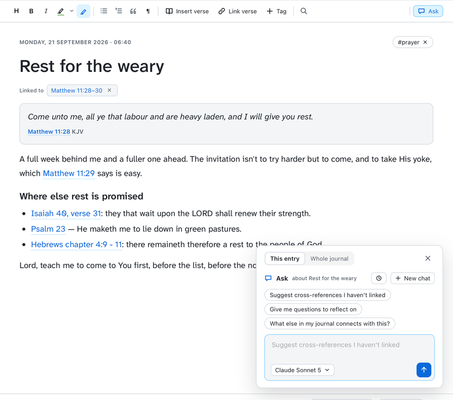

# Journal

[Features](features.md) › Journal

<a href="images/index.md#journal"><picture><source media="(prefers-color-scheme: dark)" srcset="images/journal-dark.png"></picture></a>

Dated entries with headings, bold, italic, lists, quotes and verses inserted from the Bible
(⌘N starts one). Each entry is linked to the verses it's about and shows beside them in Read
(Settings › Journal › Show notes beside verses). Entries are Markdown files, one per month, in
`~/Documents/Two-edged Sword/` (change it in Settings, e.g. to a folder in your Obsidian vault).
The toolbar highlights in the reader's eight colours, listed by name once they have names in
Settings › Highlights (the button keeps the colour last picked;
saved as `==text==` for yellow, which Obsidian shows too, and `<mark class="hl-green">` for the
others), inserts a verse, links one, and adds a tag. ⌘F finds in the entry and ⌥⌘F replaces (⌘G
for the next match; ⌘Z undoes a replacement). An Ask answer can be added to the journal in one
click.

**Listen** (top right) reads the open entry aloud, its title and then each paragraph, with the
word being spoken highlighted as in the readers. While it reads, even paused, the entry can't be
edited, so Space plays and pauses as well as ⌘P; F7 and F9 go to the previous or next entry in
the list. With Settings › Listening › Continue into the next journal entry on (or the same switch
in the player's menu), it reads on through the list. **Focus mode** (⌘., Esc to leave) hides the sidebar and the list and gives the entry 80%
of the window.

<a href="images/index.md#journal"><picture><source media="(prefers-color-scheme: dark)" srcset="images/journal-ask-dark.png"></picture></a>

**Ask** (right of the toolbar) asks about **This entry** or the **Whole journal**. **This entry**
asks about the entry and its first linked verse, drawing on your library, and can search the
rest of your journal ("What else in my journal connects with this?"). Select some text first
and it asks about that: explain it, suggest verses, say it more clearly. **Insert into entry**
puts an answer after the paragraph you were in. On a blank entry it offers prompts to start
writing. The whole journal means the entries the list shows, so a tag or filter narrows it:
"What themes keep coming back?", "How has my thinking changed over time?"

References in an entry are links, as you wrote them: hover for the verse, click to open it.
"John 3:16", "Rom 8:28-30", "1 John 5, verse 4", "Job 19, verses 25 to 27", "Genesis chapter
3:1 - 5" and a whole chapter by its book's name ("Hebrews 11", "John Chapter 6") all link, and so
do common misspellings ("Isiah", "Pillipians"). References typed now link the next time the
entry opens.

Spelling is checked by macOS's own spell checker: misspelled words get a red wavy underline,
and clicking one offers its suggestions, Add to dictionary and Ignore (either clears the
underline at once). With "Correct spelling automatically" on in macOS (Keyboard › Text Input), a
word is corrected as you finish it; ⌘Z undoes that, and clicking the word offers to change it
back. Grammar is checked too (Settings › Journal › Check grammar): problems get a blue wavy
underline, and clicking one shows macOS's explanation, its fix if it has one, and Ignore. Whole
sentences it takes for fragments aren't marked. Every word in your KJV counts as spelled right
("maketh", "shouldest", every name), and sentences in KJV English ("he maketh me", "thou art")
aren't grammar-checked. Verses inserted from the Bible aren't checked.

Changes made to the files elsewhere (in Obsidian, say) show within a few seconds, even in the
open entry, unless you have unsaved edits. If the folder the journal sits in has gone (the vault
moved), saving says so rather than starting an empty journal somewhere else. Saving an entry
keeps its month file's modified time, so an edit doesn't make an old month look new.
