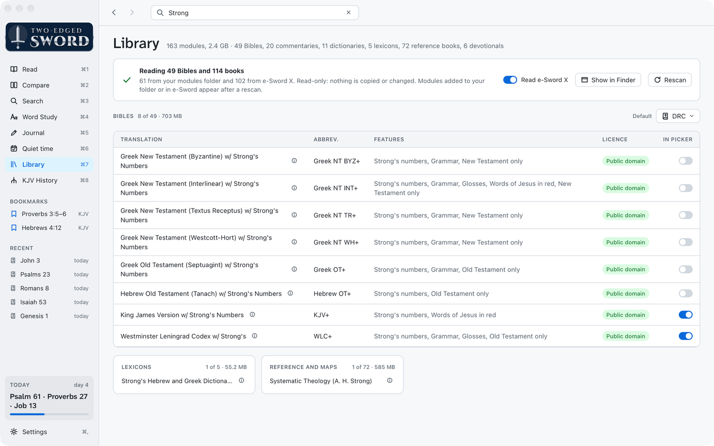

# Library

The app reads Bibles and books from three places, and never changes them:

| Folder | What |
|---|---|
| `~/Library/Application Support/Two-edged Sword/Modules/` | Your modules folder: what you copy in, and what the scripts in `tools/` build |
| `~/Library/Containers/net.e-sword.e-Sword-X/Data/Library/Application Support/` | e-Sword X's library, if you have e-Sword X |
| Inside the app | The built-in modules (below) |

- Where more than one has a module, the first in this list is used.
- e-Sword X isn't needed. Without it, that folder is skipped.
- To leave e-Sword X's library out, turn off **Read e-Sword X** on the Library screen.

## The Library screen

<a href="images/index.md#library"><picture><source media="(prefers-color-scheme: dark)" srcset="images/library-dark.png"></picture></a>

- Every module, with its size and features. The ⓘ beside one shows its description and which
  folder it came from.
- **In picker** chooses which Bibles appear in the Bible menu.
- Set the default Bible, and the order of commentaries and dictionaries.
- **Rescan** picks up modules added since the app started.
- **Show in Finder** opens your modules folder.
- **Read e-Sword X** turns e-Sword X's library on or off.

## Built-in modules

The app comes with these, so it works with nothing else installed. All are public domain.

| Module | From |
|---|---|
| King James Version (KJV), with the words of Christ in red | eBible.org and CrossWire |
| King James Version with Strong's numbers (KJV+) | eBible.org and CrossWire |
| Strong's Hebrew and Greek Dictionaries | Open Scriptures |
| King James Concordance (KJC) | Counted from the KJV+ |
| Treasury of Scripture Knowledge (TSK), the cross-references | CrossWire |
| Matthew Henry's Commentary on the Whole Bible | CrossWire, from the Christian Classics Ethereal Library |
| Easton's Bible Dictionary | CrossWire, from the Christian Classics Ethereal Library |

If you have e-Sword X, its copies of these are used instead while **Read e-Sword X** is on.

## Formats

The app reads e-Sword X's Mac formats, and the scripts in `tools/` write them:

| Extension | What |
|---|---|
| `.bbli` | Bibles |
| `.cmti` | Commentaries |
| `.dcti` | Dictionaries |
| `.lexi` | Lexicons |
| `.refi` | Reference books |
| `.devi` | Devotionals |

It doesn't read the Windows formats (`.bblx`, `.cmtx` and so on), EPUB or SWORD modules. Where a
module comes in both, take the Mac one.

## Adding modules

- **From e-Sword**: e-Sword X's Download window installs them in its library.
- **From elsewhere**: copy the file into your modules folder (not a subfolder). **Show in Finder**
  on the Library screen opens it.

Then press **Rescan**.

## Building modules

Some texts aren't e-Sword downloads. Scripts in `tools/` build them from free sources, numbered
like the KJV so they compare beside it. They write to your modules folder. Run the one you want,
then press **Rescan**.

| Script | Builds | Run first | From |
|---|---|---|---|
| `tools/crosswire/build.py` | Syriac Peshitta NT, Murdock, Etheridge, Tyndale, Geneva 1599, Douay-Rheims | | CrossWire |
| `tools/sefaria/build.py` | Targum, Targum Pseudo-Jonathan, the Babylonian Talmud | | Sefaria |
| `tools/vulgate/build.py` | Clementine Vulgate (1592) | | Clementine Vulgate Project |
| `tools/wlc/build.py` | WLC+: the Hebrew Old Testament word by word | | Open Scriptures, STEPBible |
| `tools/ginsburg/build.py` | Ginsburg's Hebrew Bible (1894) | wlc | ahembd/Ginsburg_Hebrew_Bible |
| `tools/ginsburg/plus.py` | Ginsburg+, word by word | ginsburg | WLC+ |
| `tools/beza/build.py` | Beza's Greek New Testament (1598) | | textus-receptus.com; e-Sword's TR+ if you have it |
| `tools/beza/plus.py` | Beza 1598+, word by word | beza | STEPBible |
| `tools/lxx/build.py` | Brenton's Greek Septuagint, with the Apocrypha | | eBible.org |
| `tools/lxx/plus.py` | LXX-Brenton+, word by word | lxx | e-Sword's Greek OT+, STEPBible |
| `tools/latin/build.py` | Latin+ and Vulg-C+, word by word (downloads about 1 GB) | | Stanza, Whitaker's WORDS |
| `tools/targum/build.py` | Targum+ and Ps-Jon+, word by word | sefaria, wlc | WLC+, Jastrow |
| `tools/syriac/build.py` | Peshitta+, word by word | crosswire | ETCBC, SEDRA |
| `tools/rheims/build.py` | The Rheims New Testament (1582) | crosswire | Bible Support file 11077, in ~/Downloads |

Run each with `python3`. Downloads are cached in `~/Library/Caches/Two-edged Sword/`.

All are public domain or openly licensed, except some Sefaria translations, SEDRA's glosses and
Jastrow, which are for non-commercial use. That's fine for personal study.

- `lxx/plus.py` needs e-Sword X's Greek OT+. No openly licensed tagged Septuagint exists.
- `beza/build.py` uses e-Sword X's Greek NT TR+, if you have it, to correct the transcription. Without
  it, the transcription is kept as it is.

## Free modules worth having

These are public domain. Those marked e-Sword come from e-Sword X's Download window; the rest are
on [Bible Support](https://www.biblesupport.com) (free sign-in).

**Bibles**

- Young's Literal Translation (e-Sword): very literal, a good second column beside the KJV.
- Brenton's English Septuagint (e-Sword): the Greek Old Testament the apostles quoted.
- Greek NT INT+ (e-Sword): the best single tool for the Greek behind the KJV and modern versions.
- Greek NT TR+, BYZ+ and WH+ (e-Sword): three Greek texts with Strong's numbers and grammar.
- Greek OT+ and Hebrew OT+ (e-Sword): the Old Testament in Greek and Hebrew, with Strong's
  numbers.
- Darby, Webster, Weymouth, the Revised Version, the World English Bible and the Berean Standard
  Bible (e-Sword).

**Commentaries**

- Keil & Delitzsch on the Old Testament, and Spurgeon's Treasury of David on the Psalms
  (e-Sword).
- Robertson's Word Pictures and Vincent's Word Studies (e-Sword): Greek word studies.
- The Cambridge Bible, Bullinger's Companion Bible and MacLaren's Expositions (e-Sword); Lange and
  Meyer (Bible Support).

**Dictionaries**

- Torrey's Topical Textbook and Hitchcock's Bible Names (e-Sword).
- Webster's 1828 Dictionary (e-Sword): what KJV-era English words meant.

**Books and devotionals**

- Edersheim's Life and Times of Jesus the Messiah, the Ante-Nicene Fathers, Calvin's Institutes
  and Schaff's History of the Christian Church (e-Sword).
- Spurgeon's Faith's Checkbook and his sermons (Bible Support).

Avoid copyrighted modules shared without the publisher's permission. Books that exist only as
EPUB or text need converting to a `.refi` first ([Development](development.md#reference-book-format)).

## Thanks to e-Sword

Rick Meyers has given e-Sword away free since 2000, and it has put God's word, with a lifetime of
commentaries, dictionaries and lexicons, into the hands of millions. This app reads e-Sword X's
formats and, if you have it, its library. We owe that to his work. Thank you, Rick.

- e-Sword is free, but it isn't ours to share. Its licence doesn't allow its modules to be passed
  on, so the app never copies them, and nothing from e-Sword is built into it.
- To support his work, see [e-sword.net](https://www.e-sword.net/support.html).
