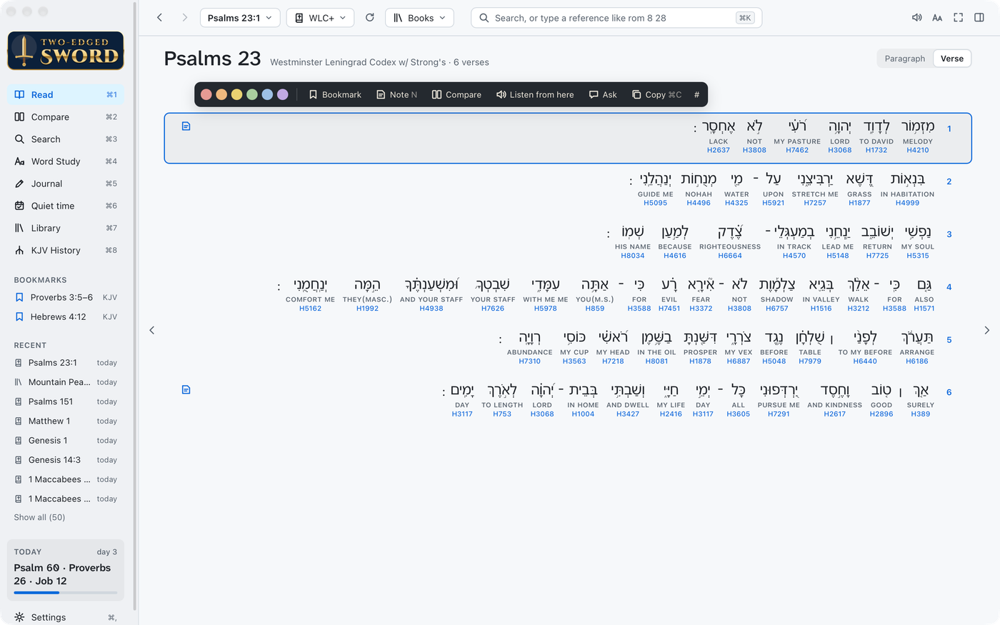
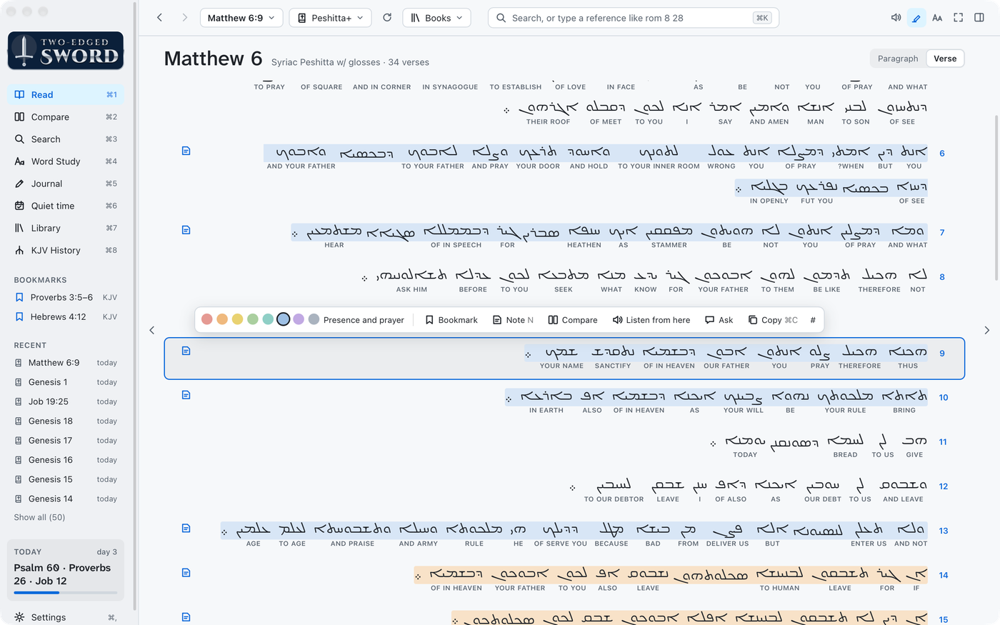

# Translations and manuscripts

<sub>[Features](features.md) › Translations and manuscripts</sub>

[Differences from the KJV](#differences-from-the-kjv) · [Greek and Hebrew](#greek-and-hebrew) ·
[KJV History](#kjv-history) · [Targums and Talmud](#targums-and-talmud)

## Differences from the KJV

<a href="images/index.md#translations-and-manuscripts"><picture><source media="(prefers-color-scheme: dark)" srcset="images/differences-dark.png"></picture></a>

In Verse layout, a **≠** beside a verse marks where the translation differs in meaning from the
KJV: an omitted verse or phrase, a changed name of God or Christ, a doctrinal word. It is faint
for minor differences. Click it for both readings, what changed and why (usually which Greek or
Hebrew manuscripts each follows). A verse the translation leaves out shows as "Not in this
translation."

Ask gets the same list, so "are there any differences in this chapter from the KJV?" is answered
from it.

The lists are reviewed one translation at a time (the NIV so far) and kept with the app's data,
not in the repo. To make one for another translation:

```sh
python3 tools/variances/candidates.py esv --books 40-66   # verses that may differ
# review the batches as tools/variances/review.md says (agents can do this in parallel)
python3 tools/variances/build.py esv                       # check them and write the list
```

`tools/variances/disputed-ot.txt` lists Old Testament verses often disputed between the KJV and
modern versions, for `candidates.py --refs`. `build.py` merges verse by verse, so books can be
added a batch at a time.

## Greek and Hebrew

<a href="images/index.md#translations-and-manuscripts"><picture><source media="(prefers-color-scheme: dark)" srcset="images/interlinear-dark.png"></picture></a>

Bibles with glosses show each original word stacked over its English and its Strong's number;
hover a number for its dictionary entry, a word for its grammar and dictionary form, and click it
to look it up. A Greek or Hebrew Bible with Strong's numbers but no English of its own (Hebrew
OT+, Greek NT BYZ+) gets each number's commonest rendering in the KJV, from your concordance;
Settings › Appearance › English under each word turns that off, and the numbers then sit after
their words, with the grammar in the word's tooltip. Right-to-left Bibles read right to left,
verse numbers on the right.

<table>
  <tr>
    <td align="center"><a href="images/index.md#translations-and-manuscripts"><picture><source media="(prefers-color-scheme: dark)" srcset="images/interlinear-hebrew-dark.png"></picture></a><br><sub>Hebrew (WLC+), Psalm 23</sub></td>
    <td align="center"><a href="images/index.md#translations-and-manuscripts"><picture><source media="(prefers-color-scheme: dark)" srcset="images/interlinear-syriac-dark.png"></picture></a><br><sub>Syriac (Peshitta+), the Lord's Prayer</sub></td>
  </tr>
</table>

- **Variant readings**: Greek NT TR+ (Stephanus 1550) and WH+ (Westcott-Hort) show another
  edition's reading muted in ⟨ ⟩, or ⟨omit⟩. Hover for whose: Scrivener 1894 in TR+,
  NA27/UBS4 in WH+. Luke 17:36 in TR+ is Scrivener's alone.
- **Which editions have a word**: Greek NT INT+ marks words that not every edition has, in red:
  τ Stephanus, σ Scrivener, β Byzantine, α Alexandrian, ν NA28. Acts 8:37 is τσ throughout.
- **Old or New Testament alone**: such a Bible opens where it starts, and the passage picker and
  chapter arrows skip the books it lacks.

## KJV History

<a href="images/index.md#translations-and-manuscripts"><picture><source media="(prefers-color-scheme: dark)" srcset="images/kjv-history-dark.png"></picture></a>

**KJV History** in the sidebar (⌘8) is the KJV's family tree: the manuscript traditions, the
printed editions the translators worked from (1604–1611), and the English Bibles before it.
Each card's chips show what you have: green is the text itself, amber the closest stand-in, blue
a related module. Click one to read it; its tooltip says whether it has the Old Testament, the New
or both. A yellow **A** beside a chip means that Bible has the Apocrypha; hover it for which books
and chapters. Hover a card to light up what it came from and what came
from it.

**Ask** opens a panel beside the tree. The history, and which sources are in your library, goes
with each question.

## Targums and Talmud

With the Targums and the Talmud built from Sefaria ([Library](library.md#building-modules)):

- The **Targums** are Bibles in the KJV's verse numbering, so they read and compare beside it
  (Isaiah 9:6 lines up with Isaiah 9:6).
- The **Talmud** is a book per tractate ("Talmud: Sanhedrin"), a chapter per daf, English with
  the Aramaic beneath.
- In a passage chat, Ask gets the Talmud passages that cite its verses: on Genesis 49:10, for
  one, Sanhedrin 98b ("Shiloh is his name").
