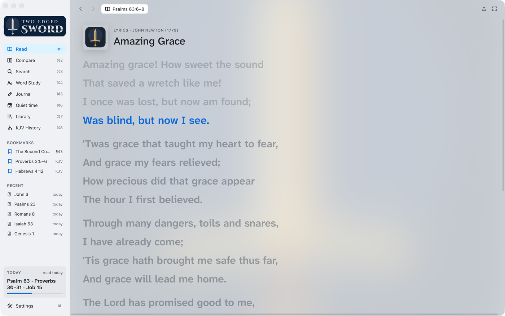
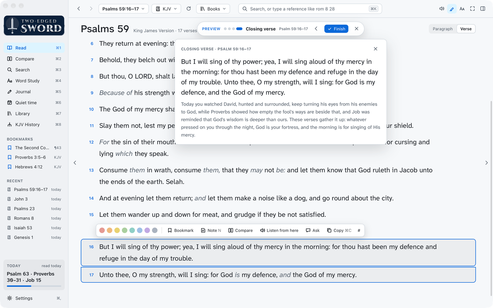

# Quiet time

[Features](features.md) › Quiet time

[Plans](#plans) · [Worship music](#worship-music) · [Closing verse](#closing-verse) · [Daily reminder](#daily-reminder) · [Menu bar](#menu-bar)

## Plans

<a href="images/index.md#quiet-time"><picture><source media="(prefers-color-scheme: dark)" srcset="images/quiet-time-dark.png"></picture></a>

Choose a reading plan: the Bible in a year, the New Testament in 90 days, the Gospels, F. B.
Meyer's daily readings, a Psalm and a Proverb a day, or your own. Add devotionals from your
library, or Our Daily Bread and Heartlight online.

- **Read** opens each of the day's readings in turn.
- **Read with audio** reads them aloud, one after another.
- Click a reading on the day's card to open just that one.
- **Mark as unread** undoes today's mark.
- **Add a website…**, under Online in the devotionals list, adds a devotional site of your own:
  a name and its address. For a page whose address changes each day, put `{yyyy}`, `{mm}` and
  `{dd}` where the date goes. Your sites can be chosen for any plan; × removes one.
- A site that won't be shown inside another app opens in its own window instead.
- An online devotional shows in the reading column, under the Quiet time bar. In the dark theme
  its page is inverted to look dark, pictures too. **Open in window** shows it in a window of its
  own, with pictures as they should be.
- In the dark theme, each online devotional has a moon button, in the devotionals list and over its
  page. Turn it off for a site that's dark already, to show it as the site made it.

Parts are ticked off as you finish them. Under the progress bar are your streak, your best run,
and how many of the last seven days you read.

| Keys | Does |
|---|---|
| F7 and F9 | Previous or next part |
| F8 or ⌘P | Pause and resume reading aloud |

## Worship music

<a href="images/index.md#quiet-time"><picture><source media="(prefers-color-scheme: dark)" srcset="images/worship-dark.png"></picture></a>

Turn it on in a plan's page. The AI assistant picks songs from your Music library to suit the
day's readings, and a card explains each choice. **Play songs** plays them in Music.

While the songs play, their words show in the reading column, and the Quiet time bar moves up
into the top bar:

<a href="images/index.md#quiet-time"><picture><source media="(prefers-color-scheme: dark)" srcset="images/lyrics-dark.png"></picture></a>

- The line being sung is lit in blue and kept in view, when the lyrics are timed. Dots show
  where nothing is sung.
- Why each song was chosen shows under its name.
- A song with no lyrics found gets softly burning flames instead, swelling to the song's tempo
  (Music's BPM for it, or a slow tempo if it has none). The app can't hear the music itself.
- **Lyrics** on the bar brings the words back if you've gone elsewhere.
- **Open Music** (top right) switches to Music.

Lyrics come from LRCLIB (lrclib.net), a free public lyrics database: the song's name, artist,
album and length are sent to it. If it has none, lyrics you've saved with the song in Music are
shown, not timed.

**Try it now**, under the Closing verse card, runs today's Quiet time with its songs and closing
verse without marking anything read. **Try it with audio** does the same, read aloud.

The first time, macOS asks whether the app may control Music.

## Closing verse

<a href="images/index.md#quiet-time"><picture><source media="(prefers-color-scheme: dark)" srcset="images/closing-dark.png"></picture></a>

Turn it on in a plan's page. Quiet time then ends with a verse or short passage, chosen by the AI
assistant to gather up what the day's reading taught.

- The passage opens in the Bible reader, lit, with a card showing its words and a few sentences
  on how it sums up the day.
- With audio, it is read aloud after a countdown that leaves time to read the card. **Read now**
  skips the wait.
- It stays open when it's done. **Finish** ends Quiet time.
- It is chosen while you read, so it's usually ready by the end.
- Without an AI assistant, the blessing of Numbers 6:24–26 closes instead.

## Daily reminder

<a href="images/index.md#quiet-time"><picture><source media="(prefers-color-scheme: dark)" srcset="images/reminder-dark.png"></picture></a>

Settings › Quiet time sends a notification at the time you choose, with the day's readings, if
you haven't read yet.

Turning it on sends one notification straight away, so macOS can ask to allow them. If none
arrive, allow Two-edged Sword in System Settings › Notifications.

The reminder comes while the app runs, including in the menu bar with its window closed. Turn on
**Open at Login** (below) so it's always running.

## Menu bar

Closing the window leaves the app in the menu bar. Its menu has:

- **Start Quiet Time**, with today's readings
- **Continue Reading**, where you left off
- **New Journal Entry** and **Search…**
- **Daily Reminder**, to turn it on or off
- **Open at Login**, to start the app in the menu bar when you log in
- **Open Two-edged Sword** and **Quit**
