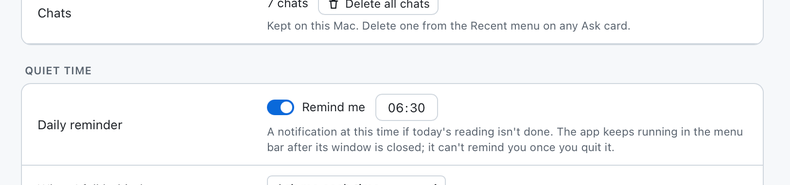
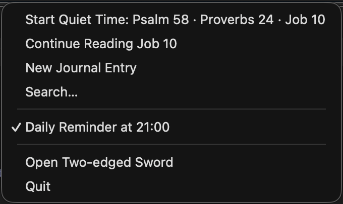

# Quiet time

[Features](features.md) › Quiet time

[Plans](#plans) · [Menu bar](#menu-bar)

## Plans

<a href="images/quiet-time-light.png"><picture><source media="(prefers-color-scheme: dark)" srcset="images/quiet-time-dark.png"></picture></a>

Reading plans: the Bible in a year, the New Testament in 90 days, the Gospels, F. B. Meyer's
daily readings (if it's in your library), your own, or a Psalm, a Proverb and one more chapter a day, read in the Bible
chosen for the plan. Add devotionals from your library, or Our Daily Bread and Heartlight online
(opened in a window of their own, dark when the app is: the page is inverted, with its pictures
left as they are).

**Read** opens each of the day's chapters and devotionals in turn, with a bar to move between
them; **Read with audio** reads them aloud one after another, two seconds apart. Parts are ticked off as they are
finished, and the day is marked read once its Bible readings are. **Mark as unread** undoes
today's mark and puts the plan back where it was. Click a reading in the day's card to open just
that chapter.

F7 and F9 go to the previous or next part, as the bar's buttons do, and F8 (or ⌘P) pauses and
resumes the reading, or reads the part showing when nothing is. During the worship songs the F
keys are left to Music. The audio player closes when Quiet time reaches the songs or an online
devotional.

<a href="images/worship-light.png"><picture><source media="(prefers-color-scheme: dark)" srcset="images/worship-dark.png"></picture></a>

**Worship music** (on the plan's page): songs from your Music library, before or after the
reading, chosen by the AI assistant to suit the day's passages. A card explains each choice;
**Play songs** starts them in Music, with pause, skip and **Lyrics** (opens Music, which shows
them) in the bar, and Space pauses too. When the last song ends, Music is stopped rather than
left on AutoPlay, and Quiet time moves on. **Try it now** runs the day's Quiet time with its
songs, without marking anything read; **Try it with audio** does the same with the readings read
aloud. macOS asks once whether the app may control Music.

Under the progress bar: how many days in a row you've read, your best run, and how many of the
last seven days (weekdays, for a weekdays-only plan, so weekends don't break the streak).

**Daily reminder** (Settings › Quiet time): a notification at the time you choose, with the day's
readings, if today isn't marked read yet. It comes once a day, and up to two hours late if the
Mac was asleep at the time. The app keeps running in the menu bar when its window is closed, so
the reminder still comes then; it can't once you quit the app. macOS asks whether to allow
notifications the first time.

<a href="images/reminder-light.png"><picture><source media="(prefers-color-scheme: dark)" srcset="images/reminder-dark.png"></picture></a>

## Menu bar

Closing the window leaves the app in the menu bar and takes it out of the Dock until the window
is opened again. Its menu has:

- **Open Two-edged Sword**.
- **Start Quiet Time**, with today's readings: the same as **Read** on the day's card. Once the
  day is read it says so, and opens Quiet time instead.
- **Continue Reading**, with the passage or book chapter you were last on.
- **New Journal Entry** and **Search…**
- **Daily Reminder at** the time set, ticked when it's on; choosing it turns the reminder on or off.
- **Open at Login**: starts the app when you log in, in the menu bar with its window closed, so
  the reminder comes without your opening it. It's the same setting as the app's switch in System
  Settings › General › Login Items.
- **Quit** (⌘Q).
