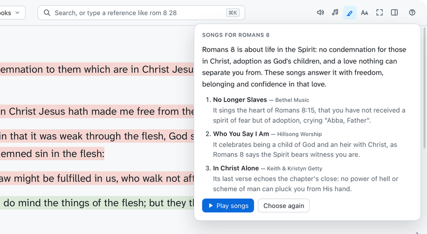

# Reading

[Features](features.md) › Reading

[Read](#read) · [Books and devotionals](#books-and-devotionals) · [Listen](#listen) · [Songs for the chapter](#songs-for-the-chapter)

## Read

<a href="images/index.md#reading"><picture><source media="(prefers-color-scheme: dark)" srcset="images/read-dark.png"></picture></a>

The chapter shows beside a study pane that follows the verse you select.

While Read or Compare is in front, and all through Quiet time, the screen doesn't sleep, so the
screensaver and lock don't come on.

### The study pane

- **Commentary**: every commentary on the verse, in your order, with cross-references from the
  Treasury of Scripture Knowledge.
- **Dictionary**: type a word to look it up in all your dictionaries.
- **Notes**: your journal entries on the verse.
- **Maps** for the book.
- **Ask**: questions about the verse or chapter ([Ask](ask.md)).

⌘\ shows or hides the pane.

### Look up a word

Click any word for its Greek or Hebrew, how the KJV translates it, and dictionary articles. The
speaker beside it says the word aloud. Words in commentaries, dictionaries and books work the
same way.

### Select verses

Click a verse to select it, or ⇧-click for a range. The toolbar above it can:

- highlight it in one of eight colours
- bookmark it
- add a note (a journal entry on the verse; N)
- compare, listen from here, or ask about it
- copy it (⌘C)

The highlighter in the top bar hides and shows all highlights.

### Move around

- ← and → turn the page. The passage picker goes book, chapter, verse.
- Hover a reference or Strong's number for a preview.
- ⌘. is focus mode: the text across most of the window. Esc leaves it.
- ⌘+ and ⌘− make the text bigger or smaller, as the **Aa** slider does, in focus mode too.

### Choose a translation

The Bible you pick lasts until you close the window; then your default (Settings › Bibles) comes
back. Favourite translations get one-click buttons in the top bar.

A ≠ beside a verse marks where the translation differs from the KJV
([Translations and manuscripts](manuscripts.md)).

### The Apocrypha

Bibles that have them (the Douay-Rheims, the Vulgates, the Bishops' Bible and the Septuagints) show
an Apocrypha section in the passage picker, between the Testaments. Apocrypha chapters are marked
in yellow wherever they appear.

## Books and devotionals

<a href="images/index.md#reading"><picture><source media="(prefers-color-scheme: dark)" srcset="images/books-dark.png"></picture></a>

The **Books** menu, beside the Bible picker, opens a reference book or devotional. Chapters are
down the side; a devotional opens on today's reading.

Paragraphs work like verses: click one to highlight, bookmark, note, listen, ask about or copy it.
The study pane has your notes on the chapter, the dictionaries and Ask.

## Listen

<a href="images/index.md#reading"><picture><source media="(prefers-color-scheme: dark)" srcset="images/listen-dark.png"></picture></a>

Reads the chapter aloud, highlighting each word as it's spoken, and carries on into the next
chapter. Choose the speed (0.5× to 2×) and a sleep timer in the player.

| Keys | Does |
|---|---|
| Space or ⌘P | Play and pause |
| F7 and F9 | Previous or next chapter |
| Esc | Close the player |

The keyboard's media keys and headphone buttons work too.

### Better voices

The app uses the voices installed on your Mac. The **Premium** ones sound far more natural:

1. Open System Settings › Accessibility › Spoken Content › System voice › Manage Voices.
2. Under English, download a voice marked (Premium), such as Zoe or Ava (US), or Jamie (UK).
3. Choose it in the player's voice menu or in Settings › Listening.

Hebrew, Greek and Latin Bibles are read in a Hebrew, Greek or Italian voice. Better ones download
the same way.

## Songs for the chapter

<a href="images/index.md#reading"><picture><source media="(prefers-color-scheme: dark)" srcset="images/chapter-songs-dark.png"></picture></a>

The ♫ button in the top bar has the AI assistant choose worship songs from your Music library to
suit the chapter you're reading, in the Bible or in a book or devotional.

1. Click ♫ and choose how many songs.
2. Click **Choose songs**. A card says what the chapter is about and why each song suits it.
3. Click **Play songs** to play them in Music. Their words show in the reading column, as in
   [Worship music](quiet-time.md#worship-music), with Pause and Next song in the top bar. Reading
   aloud stops and its player closes.

- **Choose again** picks different songs.
- These songs don't count as played for Quiet time, which leaves out songs it played in the last
  14 days.
- Without an assistant set up, songs are picked at random.
